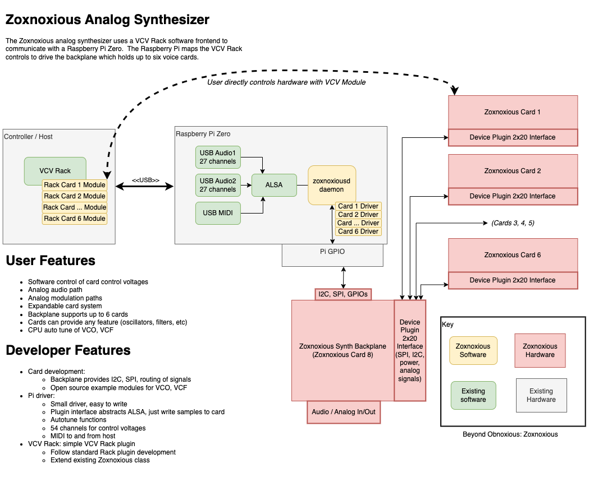

# Zoxnoxious Analog Synthesizer #

"Beyond Obnoxious"

Zoxnoxious is a hardware analog music synthesizer with a software interface.  The intent is to provide a platform for card/module development ("card" may be a better term than "module", as the latter is a well established term in the modular synth world).  Cards interface to a Raspberry Pi host controller, and the host controller responds to VCV Rack on an external computer.

# Cards #

A card is a circuit board that plugs into the Zoxnoxious backplane.  Each card receives digital signals such as I2C and SPI, and the card drives a defined set of pins with analog signals.  Cards developed to date include:

* AS3340 VCO
* AS3372 Signal Processor (VCF, VCA)
* SSI2130/AS3394 Dual VCO Synth Voice

The design allows for up to 8 cards to be controlled.  The backplane counts as one of the eight.  The current physical board is designed with 6 slots.

# Raspberry Pi Host #

A Raspberry Pi attaches to the Zoxnoxious backplane.  To a host computer, the Pi appears as USB Audio and USB MIDI devices.  Incoming USB Audio and MIDI are dispatched to a card's driver, which may choose to send SPI or I2C messages to the card.

# Zoxnoxious plugins for VCV Rack #

The user interacts with the synth through a VCV Rack plugin.  Zoxnoxious VCV Rack plugins map the Rack modules to audio channels and MIDI events that are sent via USB to the synthesizer.
