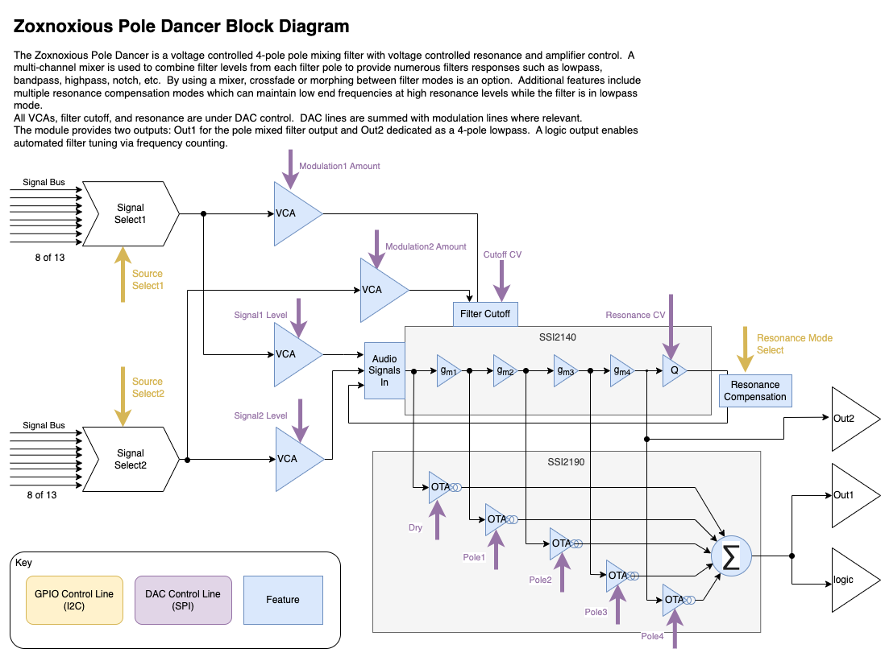

# Pole Dancer Multimode Pole Mixing Filter

The Pole Dancer may be the most versatile analog synthesizer filter.  Built around an SSI2140 four pole filter and an SSI2190 mixer provides the pole mixing.  A number of filter modes are possible using the filter mixing.  The real fun is morphing between filter modes, which can be done with manipulating the '2190 mixer.

Multiple resonance compensation modes, in addition to uncompensated, give a wide range of character.

# Block Diagram

# Resources

Datasheet TBD

[KiCanvas](https://kicanvas.org/?github=https%3A%2F%2Fgithub.com%2Fbrer-rabbit%2Fzoxnoxious%2Ftree%2Fmain%2Fkicad%2Fpoledancer)

# Demo

YouTube Demo

