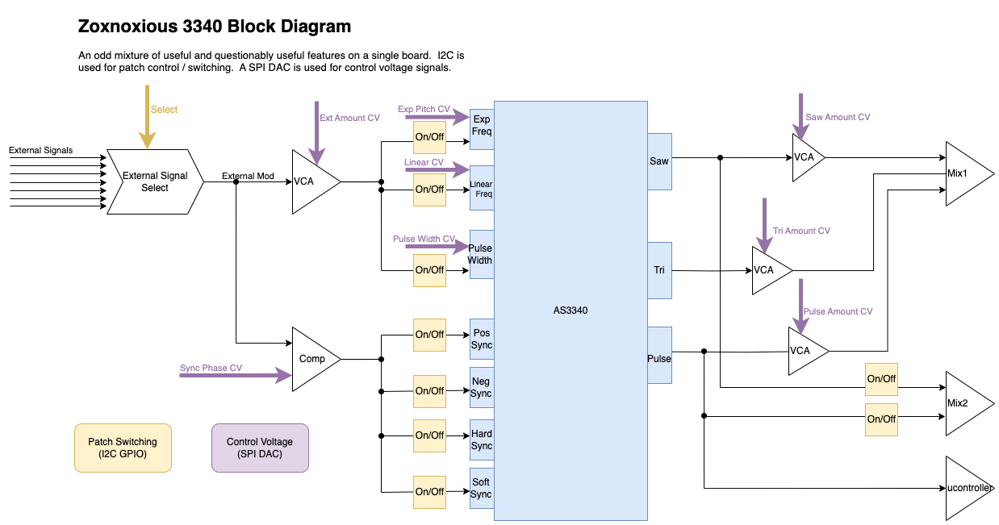

# Z3340 Voltage Controlled Oscillator

The Z3340 VCO is based around Alfa Rpar's AS3340 clone of the Curtis chip.  This design, like other Zoxnoxious designs, interfaces with the Zoxnoxious signal bus.

# Block Diagram

# Datasheet

# Demo

YouTube Demo

