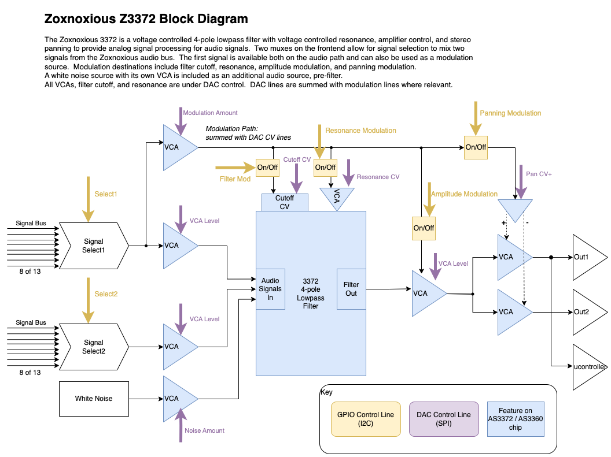

# Z3372 Voltage Controlled Filter & Noise Source

The Z3372 Analog Signal Processor utilized Alfa Rpar's AS3372 VCF/VCA.  It also contains a white noise source which can be run through the filter.  Some interseting modulation options are present, along with a stereo output.

# Block Diagram

# Resources

[Datasheet](datasheet_z3372.pdf)

[KiCanvas](https://kicanvas.org/?github=https%3A%2F%2Fgithub.com%2Fbrer-rabbit%2Fzoxnoxious%2Ftree%2Fmain%2Fkicad%2Fz3372)

# Demo

(old!) YouTube Demo

