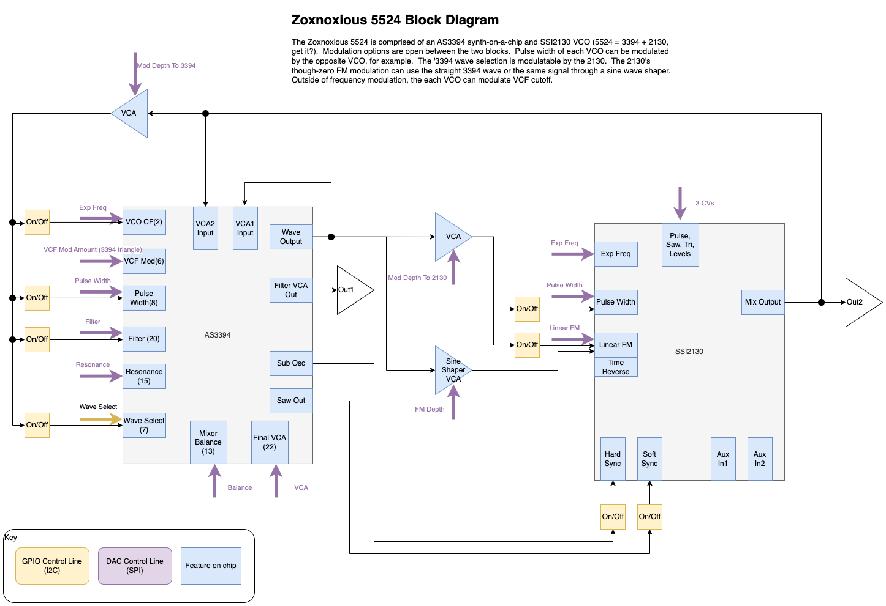

# Z5524 Dual VCO Synth Voice

The Z5524 is a full dual VCO synth voice.  The first VCO is based around an SSI2130 and features thru zero frequency modulation (TZFM).  The second VCO is from the AS3394 synth-on-a-chip.  Both VCOs run through the AS3394's VCF and VCA.

Some unique options with this setup such as combining soft sync with hard subsync, modulating the AS3394's waveselect, and some interesting options for the TZFM modulator from the AS3394 VCO.

# Block Diagram

# Resources

Datasheet TBD

[KiCanvas](https://kicanvas.org/?github=https%3A%2F%2Fgithub.com%2Fbrer-rabbit%2Fzoxnoxious%2Ftree%2Fmain%2Fkicad%2Fz5524)

# Demo

YouTube Demo

